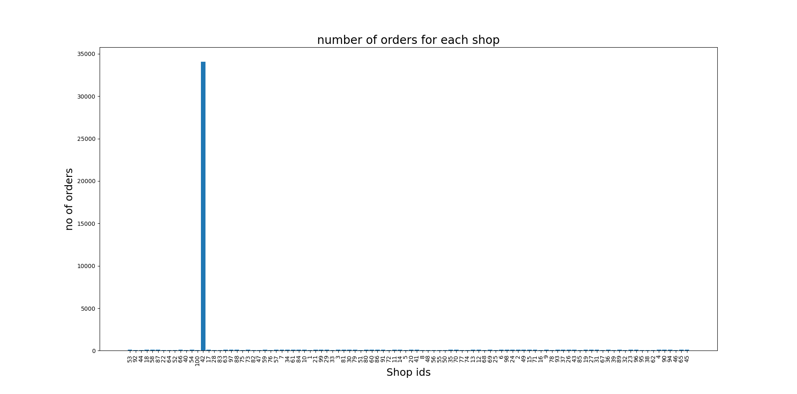
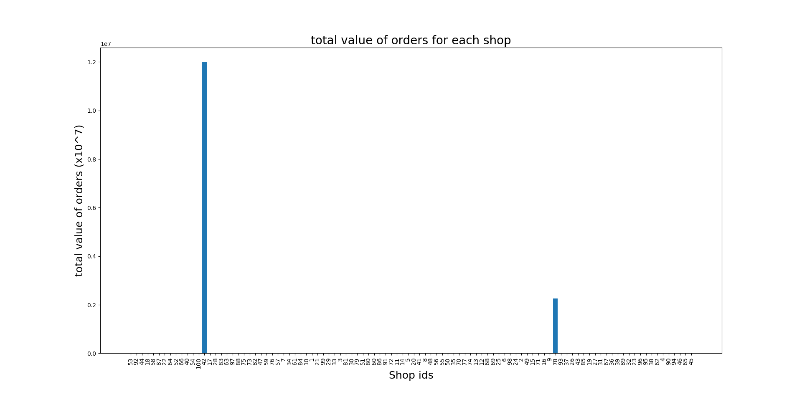
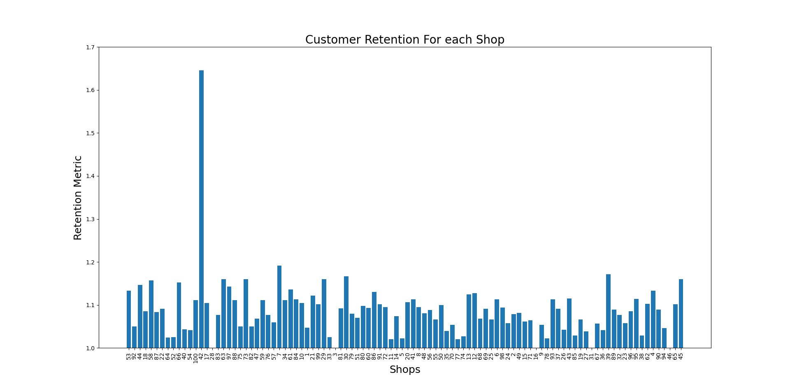
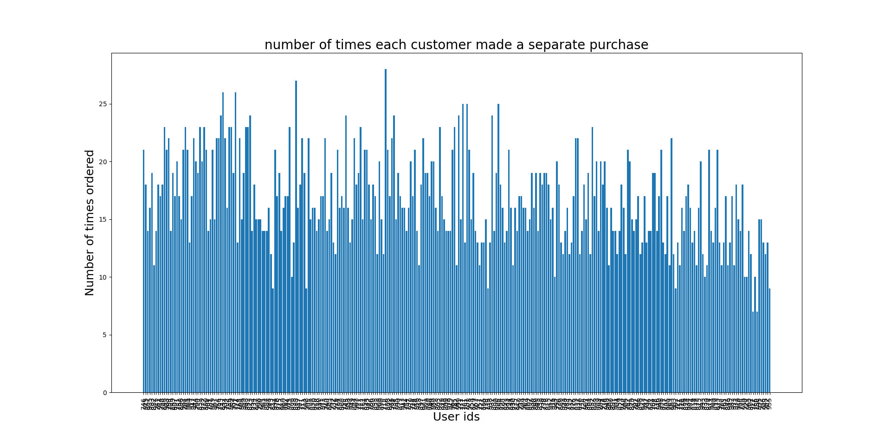
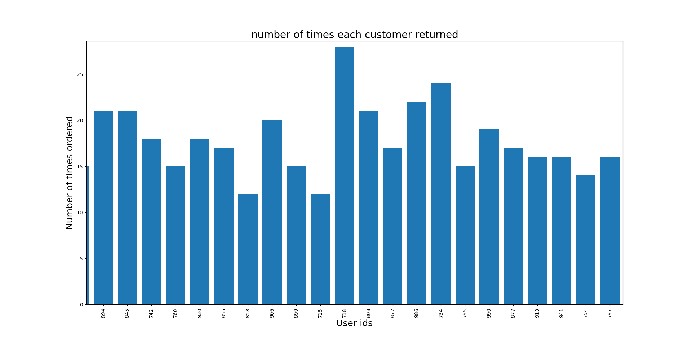
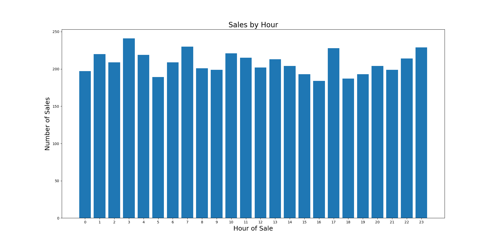

# Data-Science Challenge

### Answer 1a.
The wrong value is resulting from directly dividing the sum of order amounts by the number of order records. Instead of using the number of records, we need to use the number of items actually ordered for the division (which is a sum of the E column). This results in a reasonable AOV of 357.92 (currency unspecified).
### Answer 1b.
There are a number of interesting metrics and observations we can make from the dataset such as -
#### 1. Most successful shops in terms of number and amount of sales. 

Shopid 42 is clearly far ahead of the other shops in terms of number of ordered sneakers. We can easily see that this is largely due to a repeating order of 2000 sneakers which occurs 17 times by a recurring customer with id 607. This observation also gives us the customer providing the maximum monetary inflow among all customers (customer 607).

We see that shop 42 is far superior to other shops in terms of total value of orders as well. Shop number 78 is also high in terms of total value even though the number of orders are relatively low. This implies that shop 78 is selling much higher priced sneakers and probably is a more luxury-branded store.

We can get an even better rating for each shop’s success by subtracting the running costs of the shop from profits given the data is present.

The larger value of shop 42 can obscure analysis and comparison among other shops in the graph, so for that purpose a graph excluding shop 42 can also be generated. 
#### 2. Shops with most recurrent users (Customer Retention Data)

This graph displays a retention score for each shop.
The method of calculation for the retention metric is as specified below -

- For each shop, list the user-ids that made a purchase
- List the number of purchases each of these user-id’s made at that shop (minimum will be 1, maximum open-ended)
- Divide the total number of purchases by these users by the number of users to get the retention metric

A retention score of 1 means the lowest retention possible (i.e. each purchase at the shop was unique and no customer returned for even a second purchase).

Now that we have understood the retention score, this graph gives us a wealth of information. Shop 42 has the highest retention score, this may be correlated or even be causing its success in terms of sales numbers and amounts. Shops 28, 3, 16, 31 and 46 are doing the worst possible in terms of customer retention with each purchase being unique. 
#### 3. Customer Analytics

This graph shows the number of times each customer makes a separate purchase. 
It gives us some important information - every customer makes at least 7 separate sneaker purchases. The graph also seems to imply that most customers make more than 10 separate purchases in a 30 day window.

Note : The user id’s on the x axis appear jumbled in this picture due to a limitation of the screen size. This is not an issue when using the actual script in python to graph this data using matplotlib

Zooming in on the highest bar in the first graph gives us the above graph showing the user id of the customer who buys sneakers the most number of times - (which is user id 718 who purchased sneakers 28 separate times). 

This data does not necessarily translate to customer retention for a particular shop but just illustrates how many times a customer has bought shoes. Nevertheless, this is an important observation from the data.
#### 4. Best times of week and day for sales

The graph above shows the number of orders by the hour of the day. For example, the bar over 13 indicates the number of sales that occurred starting 1 PM and upto 2 PM. The data shows that the maximum number of sales occurred between 3 AM and 4 AM on average while the least sales happened between 4 PM and 5 PM. 

To analyze the sales by what day it is, it is more appropriate to graph average sales per day data instead of graphing the number of sales directly since otherwise the 30 days gives an unfair advantage of one day to Wednesday and Thursday.

This implies that Tuesdays see the highest number of sales on average in terms of separate purchases and Monday sees the least

Many more useful observations and metrics can be derived from this data which I will choose not to include here respecting the reader’s time.
### Answer 1c
- The value of 1 is in discovering which shops are doing well so we can invest in similar models and cater to them while at the same time trying to discover trends in shops which are not doing well and gather useful information regarding why from them.

- The value of 2 is we can identify what factors drive customer retention by investigating stores with higher customer retention and help all stores improve their customer retention.

- The value of 3 is that we can enable shops to maintain a list of repeat buyers that can be enticed with discounts and offers while gathering useful information from surveys from them and tracking their purchase behaviour to discover potentially useful trends.

- The value of 4 is in distributing ads, offers, discounts etc. that are strategically timed considering the times where sales are most prominent. It can also help with inventory tracking. It can also be used to decide the best times for website maintenance so it is aligned with a time where sales are lower.

### Answer 2a
**54** orders were shipped by Speedy Express in total
Query used - 
```
SELECT COUNT(OrderID) FROM [Orders] where ShipperID in (Select ShipperID FROM Shippers where ShipperName is 'Speedy Express')
```
### Answer 2b (or not to be, that is the question)
All puns aside, the answer is **Peacock**
I ran two queries - First
```
SELECT EmployeeID,COUNT(EmployeeID) FROM [Orders] GROUP BY EmployeeID Order by COUNT(EmployeeID) DESC LIMIT 2
```
Notice the `limit 2` that is in case there were more than one employees who had the same (max.) amount of orders so this made sure that wasn’t the case since the second most orders were 31 after 40. After ensuring this safety before I answer - I ran
```
SELECT LastName FROM [Employees] WHERE EmployeeID=4
```
which gives me **Peacock**.
We could also directly write 
```
SELECT LastName FROM [Employees] WHERE EmployeeID in (SELECT EmployeeID FROM [Orders] GROUP BY EmployeeID Order by COUNT(EmployeeID) DESC LIMIT 1)
```
If we wanted to skip the check for the common maximum.
### Answer 2c
**Gorgonzola Telino** was ordered the most by customers in Germany.
Run -
```
Select ProductID,COUNT(ProductID) AS number from OrderDetails WHERE OrderID in (Select OrderID from Orders Where CustomerID in (Select CustomerID from Customers where Country is 'Germany')) Group by ProductID Order by number DESC LIMIT 2
```
This gives the productid of the two most popular products ordered by people from germany (two to make sure there aren’t two maximums). The product id is 31.
Now,
```
SELECT ProductName FROM [Products] WHERE ProductID is 31
```
which gives us the answer.
To get the name directly without the check we can also use -
```
SELECT ProductName FROM [Products] WHERE ProductID in 
(Select ProductID from 
(Select ProductID,COUNT(ProductID) AS number from OrderDetails WHERE OrderID in 
(Select OrderID from Orders Where CustomerID in 
(Select CustomerID from Customers where Country is 'Germany')) 
Group by ProductID Order by number DESC LIMIT 1))
```
making use of subqueries.


